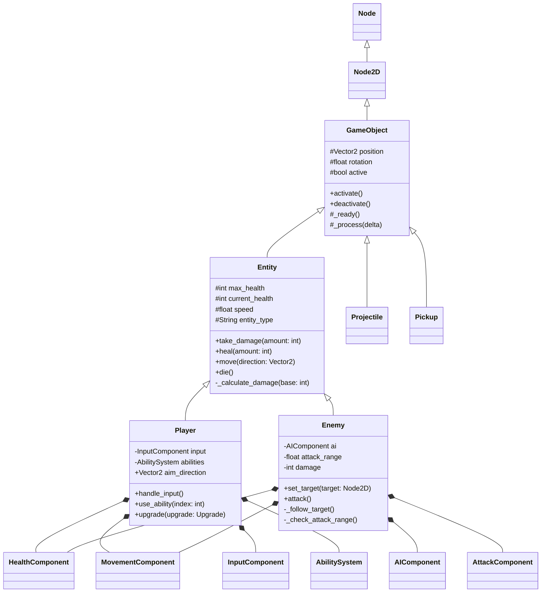
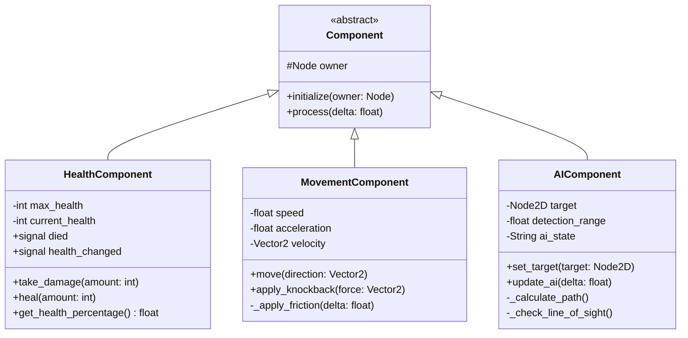
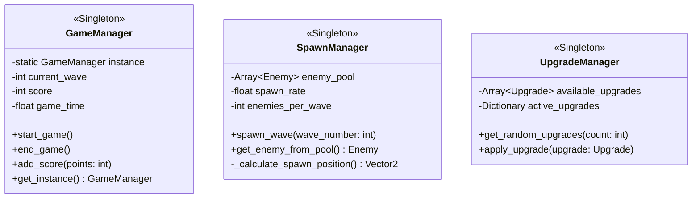

# 📐 CLASS DIAGRAM GUIDE - OOP Principles

## Voor Miro Setup

### 1. Maak Miro Board
- Titel: "Roguelite Class Architecture"
- Sections:
  - Core Classes
  - Components
  - Systems
  - Inheritance Tree

## 2. Class Diagram Requirements

### Volgens de assignment moet je tonen:
✅ **Correct verbindingen** tussen classes
✅ **Inheritance** relaties (extends)
✅ **Composition** relaties (has-a)
✅ **Properties** met types
✅ **Methods** met public/private

## 3. Basis Structure voor Roguelite



## 4. Component System (Composition)



## 5. System Classes



## 6. Miro Formatting Tips

### Colors
- **Base classes**: Light blue
- **Game objects**: Green
- **Components**: Yellow
- **Managers**: Purple
- **Abstract**: Italic text

### Connections
- **Inheritance**: Solid arrow (△)
- **Composition**: Diamond arrow (◇)
- **Association**: Simple line (—)
- **Dependency**: Dashed arrow (-->)

### Visibility
- `+` Public
- `-` Private
- `#` Protected
- `~` Package

## 7. Export voor Assignment

1. Screenshot vanuit Miro
2. Export als PNG/PDF
3. Voeg toe aan documentatie
4. Commit: `docs: add OOP class diagram`

## 8. Checklist voor Assignment

- [ ] Alle classes hebben properties
- [ ] Alle classes hebben methods
- [ ] Public/private is aangegeven
- [ ] Inheritance relaties zijn duidelijk
- [ ] Composition relaties zijn duidelijk
- [ ] Types zijn gespecificeerd
- [ ] Diagram is leesbaar
- [ ] Voldoet aan OOP principles

## 9. Voor Claude Code Prompt

```markdown
Generate the base class structure from this diagram:
- GameObject base class
- Entity extends GameObject
- Player and Enemy extend Entity
- All components as separate classes
- Include all properties and methods as shown
- Follow Godot 4.3 best practices
```

---

*Gebruik dit als guide voor je Miro class diagram!*