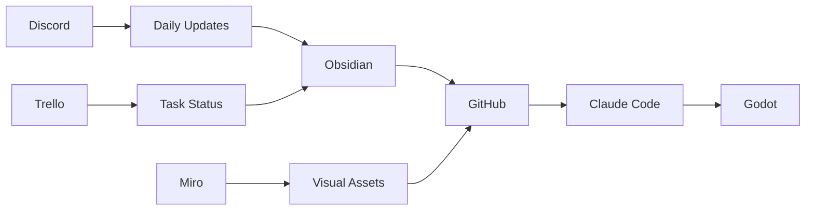

# 🛠️ TOOLS OVERZICHT - Roguelite Project

## Development Tools

### 🎮 Game Development
- **Engine**: Godot 4.3
- **Language**: GDScript (met static typing)
- **IDE**: VS Code of Cursor (nog te beslissen)
- **Version Control**: Git + GitHub (PUBLIC repository)

### 🤖 AI Assistants
- **Claude Desktop**: Voor iteratie, discussie, snippets
- **Claude Code**: Voor complete implementaties
- **MCP Integraties**:
  - **Filesystem MCP**: Voor file operations
  - **Zapier + Trello MCP**: Voor task automation (NEW!)
  - **Godot MCP**: (Research needed)
- **GitHub Copilot**: (Mogelijk, als VS Code wordt gekozen)

## 📊 Project Management

### Task Management
- **Trello**: Color-coded priority system
  - 🔴 Red: Critical
  - 🟠 Orange: Important  
  - 🟡 Yellow: Should do
  - 🟢 Green: Could do
  - ⚫ Grey: Nice to have

### Visual Planning
- **Miro**: 
  - Moodboards
  - Class diagrams
  - Visual references
  - Game flow charts

### Documentation
- **Obsidian**: Deze vault
- **Markdown**: Alle documentatie

## 🎨 Art & Design

### Creation Tools
- **Aseprite**: Pixel art & animation (€20)
- **Krita**: Free alternative
- **Procreate**: iPad option

### Asset Formats
- **Sprites**: PNG transparent
- **Resolution**: 32x32 baseline
- **Animations**: 10-12 FPS

## 💬 Communication

### Team Communication
- **Discord**: 
  - Channels: #daily-updates, #blockers, #code, #art
  - Screen sharing voor debugging
  - File sharing
  
### Speech-to-Text
- **Voicy**: Voor updates naar Claude
- **Format**: Nederlands met Engelse tech terms

## 🔧 Supporting Tools

### Performance
- **Godot Profiler**: Built-in
- **RenderDoc**: GPU debugging (optional)

### Audio (Later)
- **Suno AI**: Music generation
- **Udio**: Alternative for music
- **sfxr/bfxr**: Retro sound effects

## 📱 Mobile Access

### Options
1. **GitHub**: Browser bookmarks
2. **Discord**: App notifications
3. **Obsidian Mobile**: Vault sync
4. **Trello**: Mobile app

## 🔗 Integration Flow

## 🚀 Tool Setup Checklist

### Already Setup ✅
- [x] Obsidian vault structure
- [x] Discord templates
- [x] Documentation files

### TODO Setup 📝
- [ ] GitHub repository (public)
- [ ] Trello board creation
- [ ] Miro board for moodboards
- [ ] Discord server & channels
- [ ] Godot 4.3 installation
- [ ] VS Code/Cursor decision
- [ ] MCP integration research

## 💡 Tool Decisions Pending

### IDE Choice
**VS Code** vs **Cursor**

VS Code pros:
- More extensions
- GitHub Copilot
- Familiar

Cursor pros:
- Built-in AI
- Modern
- Faster?

### MCP Setup
Research needed for:
- Godot documentation integration
- Best practices automation
- Performance guidelines

---

*This list will be updated as tools are chosen and configured*