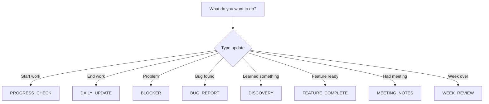

# 🎙️ Speech-to-Claude Workflow

## How to use this system?

### Step 1: Start working (whenever)
```
1. Open the Templates/ folder
2. Get PROGRESS_CHECK_TEMPLATE.md
3. Quickly fill in what you'll work on
4. Send to Claude
```

### Step 2: During work
```
If you discover something → DISCOVERY_TEMPLATE.md
If you're stuck → BLOCKER_TEMPLATE.md  
If you find a bug → BUG_REPORT_TEMPLATE.md
Feature done → FEATURE_COMPLETE_TEMPLATE.md
```

### Step 3: Done working (whenever)
```
1. Get DAILY_UPDATE_TEMPLATE.md
2. Speak in everything you've done
3. Send to Claude with: "Update vault with this daily update"
4. Claude does the rest!
```

## 🗣️ Speech-to-Text Instructions

### For Voicy (or other tool):
1. **Start new section**: Say "new line new line"
2. **Make list**: Say "dash" for each point
3. **Time**: Say for example "three hours" or "15 minutes"
4. **Code terms**: Spell out or say slowly

### Example speech input:
```
"Today worked on player movement new line new line
What worked well new line
dash WASD movement is smooth new line  
dash collision detection works new line new line
Problems new line
dash controller input gives errors new line
dash dash mechanic not yet implemented"
```

## 🤖 What does Claude do with your input?

### Automatically:
- ✅ Creates `Daily_Updates/2025-08-XX.md` file
- ✅ Updates `TODO.md` with completed/blocked items
- ✅ Adds issues to troubleshooting
- ✅ Updates relevant guides with new knowledge
- ✅ Tracks progress metrics
- ✅ Makes nice formatting from your speech input

### You DON'T need to:
- ❌ Create files yourself
- ❌ Maintain TODO list yourself
- ❌ Format perfectly
- ❌ Document Git commits (do that later)
- ❌ Remember what goes where

## 📋 Template Choice Helper



## 💬 Standard Claude Instructions

### Copy-paste these:

**For daily update:**
```
Update the Roguelite vault with this daily update:
[TEMPLATE HERE]
```

**For blocker:**
```
URGENT - Help with this blocker and update vault:
[TEMPLATE HERE]
```

**For discovery:**
```
Add this new knowledge to the appropriate guides:
[TEMPLATE HERE]
```

## 🔄 Flexible Schedule

### No fixed times!
- **Work in the afternoon?** → Fine
- **Work in the evening?** → Fine
- **Skip a day?** → Fine
- **Work on weekend?** → Fine

### Minimum commitment:
- Try to send 1 update per work session
- Week review only if you actually worked a week
- Meeting notes only for important calls

## 📁 Where to find everything?

```
Templates/
├── CLAUDE_WORKFLOW.md          ← This file
├── DAILY_UPDATE_TEMPLATE.md    ← Most used
├── PROGRESS_CHECK_TEMPLATE.md  ← Quick updates
├── BLOCKER_TEMPLATE.md        ← For problems
├── DISCOVERY_TEMPLATE.md      ← New knowledge
├── FEATURE_COMPLETE_TEMPLATE.md
├── BUG_REPORT_TEMPLATE.md
├── MEETING_NOTES_TEMPLATE.md
└── WEEK_REVIEW_TEMPLATE.md
```

## ⚡ Super Quick Start

1. **Right now**: Bookmark the Templates/ folder
2. **Start work**: "Hey Claude, I'm going to start with [task]"
3. **End work**: Use DAILY_UPDATE_TEMPLATE
4. **Claude**: Keeps track of everything!

## 🎯 Success Metrics

This system works when:
- You don't have to think about documentation
- Updates take < 5 minutes
- You can find everything
- Jade can see what you've done
- The vault stays up-to-date

---

*Remember: Perfect is the enemy of done. Just talk, Claude makes it nice!*