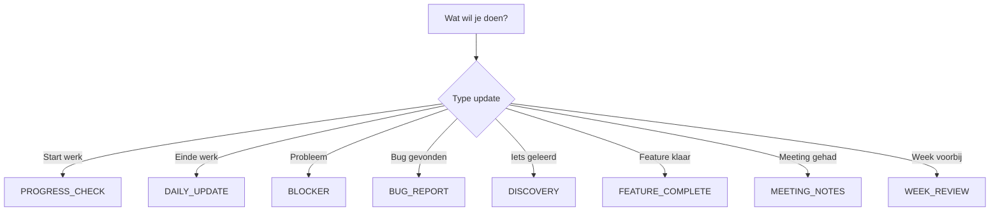

# 🎙️ Speech-to-Claude Workflow

## Hoe gebruik je dit systeem?

### Stap 1: Begin met werken (wanneer dan ook)
```
1. Open de Templates/ folder
2. Pak PROGRESS_CHECK_TEMPLATE.md
3. Vul snel in waar je aan gaat werken
4. Stuur naar Claude
```

### Stap 2: Tijdens het werk
```
Als je iets ontdekt → DISCOVERY_TEMPLATE.md
Als je vast zit → BLOCKER_TEMPLATE.md  
Als je bug vindt → BUG_REPORT_TEMPLATE.md
Feature af → FEATURE_COMPLETE_TEMPLATE.md
```

### Stap 3: Klaar met werken (wanneer dan ook)
```
1. Pak DAILY_UPDATE_TEMPLATE.md
2. Praat alles in wat je hebt gedaan
3. Stuur naar Claude met: "Update vault met deze daily update"
4. Claude doet de rest!
```

## 🗣️ Speech-to-Text Instructies

### Voor Voicy (of andere tool):
1. **Start nieuwe sectie**: Zeg "nieuwe regel nieuwe regel"
2. **Lijst maken**: Zeg "streepje" voor elk punt
3. **Tijd**: Zeg bijvoorbeeld "drie uur" of "15 minuten"
4. **Code termen**: Spell uit of zeg langzaam

### Voorbeeld speech input:
```
"Vandaag gewerkt aan player movement nieuwe regel nieuwe regel
Wat werkte goed nieuwe regel
streepje WASD movement is smooth nieuwe regel  
streepje collision detection werkt nieuwe regel nieuwe regel
Problemen nieuwe regel
streepje controller input geeft errors nieuwe regel
streepje dash mechanic nog niet geimplementeerd"
```

## 🤖 Wat doet Claude met jouw input?

### Automatisch:
- ✅ Maakt `Daily_Updates/2025-08-XX.md` file
- ✅ Update `TODO.md` met completed/blocked items
- ✅ Voegt issues toe aan troubleshooting
- ✅ Update relevante guides met nieuwe kennis
- ✅ Houdt progress metrics bij
- ✅ Maakt mooie formatting van je speech input

### Je hoeft NIET:
- ❌ Zelf files aan te maken
- ❌ Zelf TODO lijst bij te houden
- ❌ Perfect te formatteren
- ❌ Git commits te documenteren (doe je later)
- ❌ Te onthouden wat waar staat

## 📋 Template Keuze Helper



## 💬 Standaard Claude Instructies

### Copy-paste deze:

**Voor daily update:**
```
Update de Roguelite vault met deze daily update:
[TEMPLATE HIER]
```

**Voor blocker:**
```
URGENT - Help met deze blocker en update vault:
[TEMPLATE HIER]
```

**Voor discovery:**
```
Voeg deze nieuwe kennis toe aan de juiste guides:
[TEMPLATE HIER]
```

## 🔄 Flexibel Schema

### Geen vaste tijden!
- **Werk je 's middags?** → Prima
- **Werk je 's avonds?** → Prima
- **Skip je een dag?** → Prima
- **Werk je weekend?** → Prima

### Minimale commitment:
- Probeer 1x per werk-sessie een update te sturen
- Week review alleen als je echt een week hebt gewerkt
- Meeting notes alleen bij belangrijke calls

## 📁 Waar vind ik alles?

```
Templates/
├── CLAUDE_WORKFLOW.md          ← Dit bestand
├── DAILY_UPDATE_TEMPLATE.md    ← Meest gebruikt
├── PROGRESS_CHECK_TEMPLATE.md  ← Quick updates
├── BLOCKER_TEMPLATE.md        ← Bij problemen
├── DISCOVERY_TEMPLATE.md      ← Nieuwe kennis
├── FEATURE_COMPLETE_TEMPLATE.md
├── BUG_REPORT_TEMPLATE.md
├── MEETING_NOTES_TEMPLATE.md
└── WEEK_REVIEW_TEMPLATE.md
```

## ⚡ Super Quick Start

1. **Nu meteen**: Bookmark de Templates/ folder
2. **Begin werk**: "Hey Claude, ik ga beginnen met [taak]"
3. **Einde werk**: Gebruik DAILY_UPDATE_TEMPLATE
4. **Claude**: Houdt alles bij!

## 🎯 Success Metrics

Dit systeem werkt als:
- Je hoeft niet na te denken over documentatie
- Updates kosten < 5 minuten
- Je kunt alles terugvinden
- Jade kan zien wat je hebt gedaan
- De vault blijft up-to-date

---

*Remember: Perfect is the enemy of done. Praat gewoon, Claude maakt het mooi!*