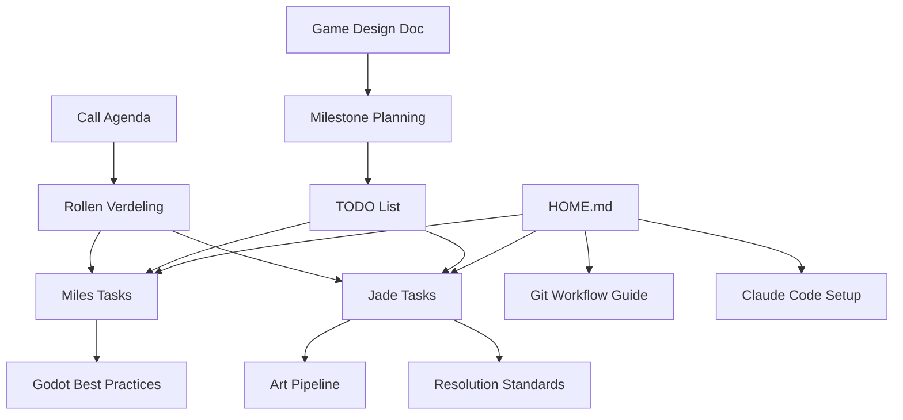

# 📚 Document Index - Roguelite Project

## 🗂️ Documentatie Overzicht

### 🏠 Hoofdpagina
- **[[HOME]]** - Centrale hub met alle belangrijke links

### 📋 Project Documenten
| Document | Doel | Status | Laatste Update |
|----------|------|--------|----------------|
| [[Call_Agenda]] | Meeting notes & beslissingen | ✅ Completed | 6 Aug |
| [[Game_Design_Document]] | Core game design | 📝 Active | 5 Aug |
| [[Project_Samenvatting]] | Project historie & concept | 📚 Reference | 5 Aug |
| [[Milestone_Planning]] | Gedetailleerde planning | 📅 Active | 5 Aug |
| [[TODO]] | Concrete taken lijst | ✅ Updated | 7 Aug |

### 👥 Persoonlijke Taken
| Document | Voor | Type |
|----------|------|------|
| [[Personal_Tasks/Miles_Week1_Tasks]] | Miles | Week 1 taken |
| [[Personal_Tasks/Jade_Week1_Tasks]] | Jade | Week 1 taken |
| [[Personal_Tasks/Rollen_Verdeling]] | Beiden | Wie doet wat |

### 🛠️ Development Guides (Nieuw!)
| Guide | Onderwerp | Prioriteit |
|-------|-----------|------------|
| [[Development_Guides/Git_Workflow_Guide]] | Git & branches | 🔴 High |
| [[Development_Guides/Claude_Code_Setup]] | AI workflow | 🔴 High |
| [[Development_Guides/Claude_Code_GitHub_Integration]] | AI + GitHub workflow | 🟡 Medium |
| [[Development_Guides/Godot_Best_Practices]] | Roguelite patterns | 🟡 Medium |
| [[Development_Guides/Performance_Guidelines]] | 100+ enemies | 🟡 Medium |
| [[Development_Guides/Art_Pipeline]] | Asset workflow | 🟡 Medium |
| [[Development_Guides/Resolution_Standards]] | Sprite sizes | 🟡 Medium |

### 📖 Technische Referenties
| Document | Inhoud | Gebruik |
|----------|--------|---------|
| [[Tech_Referentie]] | Godot neon effects | Quick lookup |
| [[Sprite_Performance_Guide]] | 64x64 approach | Alternative |
| [[Git_Workflow]] | Team coordination | Extra Git info |
| [[Trello_Workflow]] | Task management | Trello gebruik |

## 🔄 Document Relaties

## 📝 Gebruik Tips

### Voor Miles:
1. Start bij **HOME.md**
2. Check **Miles_Week1_Tasks.md** voor vandaag
3. Gebruik **Git_Workflow_Guide.md** voor setup
4. Refereer **Claude_Code_Setup.md** voor AI hulp

### Voor Jade:
1. Start bij **HOME.md**
2. Check **Jade_Week1_Tasks.md** voor vandaag
3. Lees **Art_Pipeline.md** voor workflow
4. Test met **Resolution_Standards.md**

### Voor Beiden:
- **Trello_Workflow.md** voor task management
- **Rollen_Verdeling.md** voor verantwoordelijkheden
- **Performance_Guidelines.md** voor optimization

## 🚀 Quick Links per Fase

### Week 1 (Nu):
- [[Personal_Tasks/Miles_Week1_Tasks|Miles Tasks]]
- [[Personal_Tasks/Jade_Week1_Tasks|Jade Tasks]]
- [[Development_Guides/Git_Workflow_Guide|Git Setup]]

### Week 2-4:
- [[Milestone_Planning|Complete Planning]]
- [[Game_Design_Document|Design Specs]]
- [[Development_Guides/Performance_Guidelines|Performance]]

### Reference:
- [[Tech_Referentie|Godot Effects]]
- [[Development_Guides/Godot_Best_Practices|Best Practices]]

---

*Laatste update: 7 Augustus 2025*