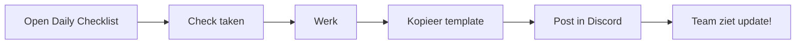

# 🏠 ROGUELITE PROJECT - HOME

## 📢 FILESYSTEM MCP NOTICE
```yaml
Current Directory: C:\Users\mzeil\Documents\Notes 2025\Roguelite
Note: Dit wordt later de game repository directory
Usage: "Use filesystem mcp to update notes in this directory"
Voicy: Speech-to-text tool (maakt soms fouten)
```

## 📱 Mobile Quick Access

### Voor MILES:
👉 **[01_MILES/DAILY_CHECKLIST.md](01_MILES/DAILY_CHECKLIST.md)** - Bookmark dit!

### Voor JADE:  
👉 **[02_JADE/DAILY_CHECKLIST.md](02_JADE/DAILY_CHECKLIST.md)** - Bookmark dit!

### Discord Setup:
👉 **[03_SHARED/DISCORD_MOBILE_SETUP.md](03_SHARED/DISCORD_MOBILE_SETUP.md)** - Channels & templates

---

## 📁 Nieuwe Structuur (Veel Overzichtelijker!)

```
🎮 ROGUELITE/
│
├── 📌 00_START/              ← BEGIN HIER
│   └── START_HIER.md        ← Alles wat je moet weten
│
├── 👨‍💻 01_MILES/              ← ALLEEN VOOR MILES
│   ├── DAILY_CHECKLIST.md   ← Mobile bookmark!
│   └── Miles_Week1_Tasks.md ← Jouw taken
│
├── 👩‍🎨 02_JADE/               ← ALLEEN VOOR JADE
│   ├── DAILY_CHECKLIST.md   ← Mobile bookmark!
│   └── Jade_Week1_Tasks.md  ← Haar taken
│
├── 🤝 03_SHARED/             ← VOOR BEIDEN
│   ├── DISCORD_MOBILE_SETUP.md
│   └── Rollen_Verdeling.md
│
├── 📚 Development_Guides/    ← HOE-TO GUIDES
├── 🗣️ Templates/             ← SPEECH TEMPLATES
├── 📝 Daily_Updates/         ← CLAUDE MAAKT DEZE
└── 📋 [Overige docs...]      ← Reference
```

---

## 🚀 Start Morgen Met:

### STAP 1: Setup Discord
1. Open `03_SHARED/DISCORD_MOBILE_SETUP.md`
2. Maak channels volgens lijst
3. Pin belangrijke messages

### STAP 2: Bookmark op Telefoon
- Miles: `01_MILES/DAILY_CHECKLIST.md`
- Jade: `02_JADE/DAILY_CHECKLIST.md`

### STAP 3: Eerste Update
Kopieer template uit DAILY_CHECKLIST naar Discord

---

## 💬 Update Workflow



---

## 🎯 Week 1 Overview

### Miles Focus:
- Git setup ✓
- Godot project ✓
- Player movement ✓

### Jade Focus:
- Art tools ✓
- Sprite tests ✓
- Style guide ✓

### Shared:
- Discord communicatie ✓
- Daily updates ✓
- Week review Friday ✓

---

*Dit is je nieuwe home - veel cleaner! 🎉*