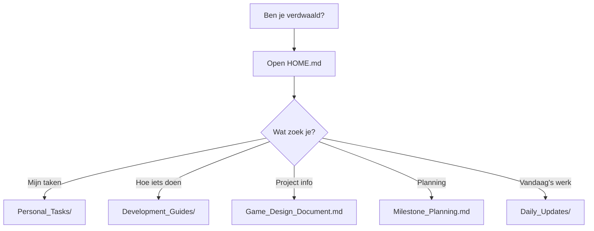

# 📖 README - Roguelite Project Documentatie

## 🎯 Wat is dit?
Dit is jullie **Obsidian vault** voor het Roguelite game project. Alle documentatie, planning, guides en notities staan hier georganiseerd.

## 🗺️ Hoe navigeer ik?

### Start altijd hier:
1. **`HOME.md`** - Je dashboard met quick links
2. **`DOCUMENT_INDEX.md`** - Complete lijst van alle documenten

### 🚦 Kleurcodering voor prioriteit:
- 🔴 **ROOD** = Vandaag nodig
- 🟡 **GEEL** = Deze week belangrijk  
- 🟢 **GROEN** = Reference/later

## 📁 Directory Structuur Uitleg

```
Roguelite/
│
├── 🏠 HOME.md                    ← START HIER
├── 📖 README.md                  ← Dit bestand
├── 🔄 DAILY_WORKFLOW.md          ← Oude workflow (zie Templates/)
│
├── 🎙️ Templates/                  ← SPEECH-TO-CLAUDE TEMPLATES
│   ├── Speech_To_Claude_Workflow.md  ← Hoe dit werkt
│   ├── DAILY_UPDATE_TEMPLATE.md     ← Dagelijks gebruiken
│   ├── PROGRESS_CHECK_TEMPLATE.md
│   ├── BLOCKER_TEMPLATE.md
│   └── [meer templates...]
│
├── 📋 Planning & Tracking/
│   ├── TODO.md                   ← Concrete taken
│   ├── Milestone_Planning.md     ← Augustus roadmap
│   ├── Call_Agenda.md           ← Meeting notes
│   └── Trello_Workflow.md       ← Task management
│
├── 👥 Personal_Tasks/            ← JULLIE TAKEN
│   ├── Miles_Week1_Tasks.md     🔴 Miles start hier
│   ├── Jade_Week1_Tasks.md      🔴 Jade start hier
│   └── Rollen_Verdeling.md      ← Wie doet wat
│
├── 🛠️ Development_Guides/        ← HOE-TO GUIDES
│   ├── Git_Workflow_Guide.md    🔴 Vandaag nodig
│   ├── Claude_Code_Setup.md     🔴 Voor Miles
│   ├── Art_Pipeline.md          🔴 Voor Jade
│   ├── Resolution_Standards.md  🟡 Deze week
│   ├── Godot_Best_Practices.md  🟡 Reference
│   └── Performance_Guidelines.md 🟢 Later
│
├── 📚 Reference_Docs/            ← NASLAGWERK
│   ├── Game_Design_Document.md  ← Game specs
│   ├── Tech_Referentie.md       ← Quick lookup
│   ├── Project_Samenvatting.md  ← Historie
│   └── Sprite_Performance_Guide.md ← Alt approach
│
└── 📝 Daily_Updates/             ← CLAUDE MAAKT DEZE
    └── 2025-08-07.md            ← Vandaag's notes
```

## 🚀 Quick Start Guides

### Voor MILES (Start wanneer je wilt):
```markdown
🔴 MUST DO VANDAAG:
1. Open: Personal_Tasks/Miles_Week1_Tasks.md
2. Lees: Development_Guides/Git_Workflow_Guide.md  
3. Setup: Development_Guides/Claude_Code_Setup.md
4. Start: Godot project volgens taken lijst

🎙️ VOOR UPDATES:
5. Gebruik: Templates/DAILY_UPDATE_TEMPLATE.md
6. Stuur naar Claude: "Update vault met deze info"
```

### Voor JADE (Start wanneer je wilt):
```markdown
🔴 MUST DO VANDAAG:
1. Open: Personal_Tasks/Jade_Week1_Tasks.md
2. Lees: Development_Guides/Art_Pipeline.md
3. Check: Development_Guides/Resolution_Standards.md  
4. Start: Sprite tests maken (16/32/64px)

🎙️ VOOR UPDATES:
5. Gebruik: Templates/DAILY_UPDATE_TEMPLATE.md
6. Stuur naar team Discord of naar Miles
```

## 💡 Verdwaald? Volg dit pad:



## 📝 Documentatie Updates

### Dagelijks (5 min):
- Update `Daily_Updates/[datum].md` met progress
- Check `TODO.md` voor taken status

### Wekelijks (15 min):
- Review `Milestone_Planning.md`
- Update `Personal_Tasks/` voor volgende week
- Archive oude daily updates

## 🔍 Zoeken in Obsidian

### Quick Search (Ctrl+O):
- `tag:#urgent` - Alle urgente items
- `tag:#miles` - Miles' taken
- `tag:#jade` - Jade's taken  
- `tag:#blocked` - Geblokkeerde items

### Handige Links:
- `[[` - Start typing voor auto-complete
- `[[HOME]]` - Terug naar hoofdpagina
- `[[TODO]]` - Naar taken lijst

## ⚡ Emergency Procedures

### "Ik weet niet wat ik moet doen":
1. Open `Personal_Tasks/[Jouw_Naam]_Week1_Tasks.md`
2. Check de daily checklist
3. Vraag in Discord als nog onduidelijk

### "Git is kapot":
1. Open `Development_Guides/Git_Workflow_Guide.md`
2. Check "Emergency Procedures" sectie
3. Tag Miles in Discord voor hulp

### "Performance issues":
1. Open `Development_Guides/Performance_Guidelines.md`
2. Run de performance checklist
3. Document in `Daily_Updates/`

## 🏷️ Tags Systeem

We gebruiken deze tags in documenten:
- `#urgent` - Moet vandaag
- `#week1` `#week2` etc - Week planning
- `#miles` `#jade` - Persoon specifiek
- `#blocked` - Wacht op iets/iemand
- `#done` - Completed
- `#reference` - Voor later lookup

## 📊 Status Indicators

In documenten zie je:
- ✅ Completed
- 🚧 In progress  
- ❌ Blocked
- 📝 Needs update
- 🔄 Daily recurring

## 💬 Vragen?

1. Check eerst deze README
2. Zoek in relevante guide
3. Post in Discord channel
4. Tag teamlid voor hulp

---

**Remember**: Deze vault is jullie "single source of truth" - alles staat hier!

*Laatste update: 7 Augustus 2025*  
*Maintainer: Miles & Jade*